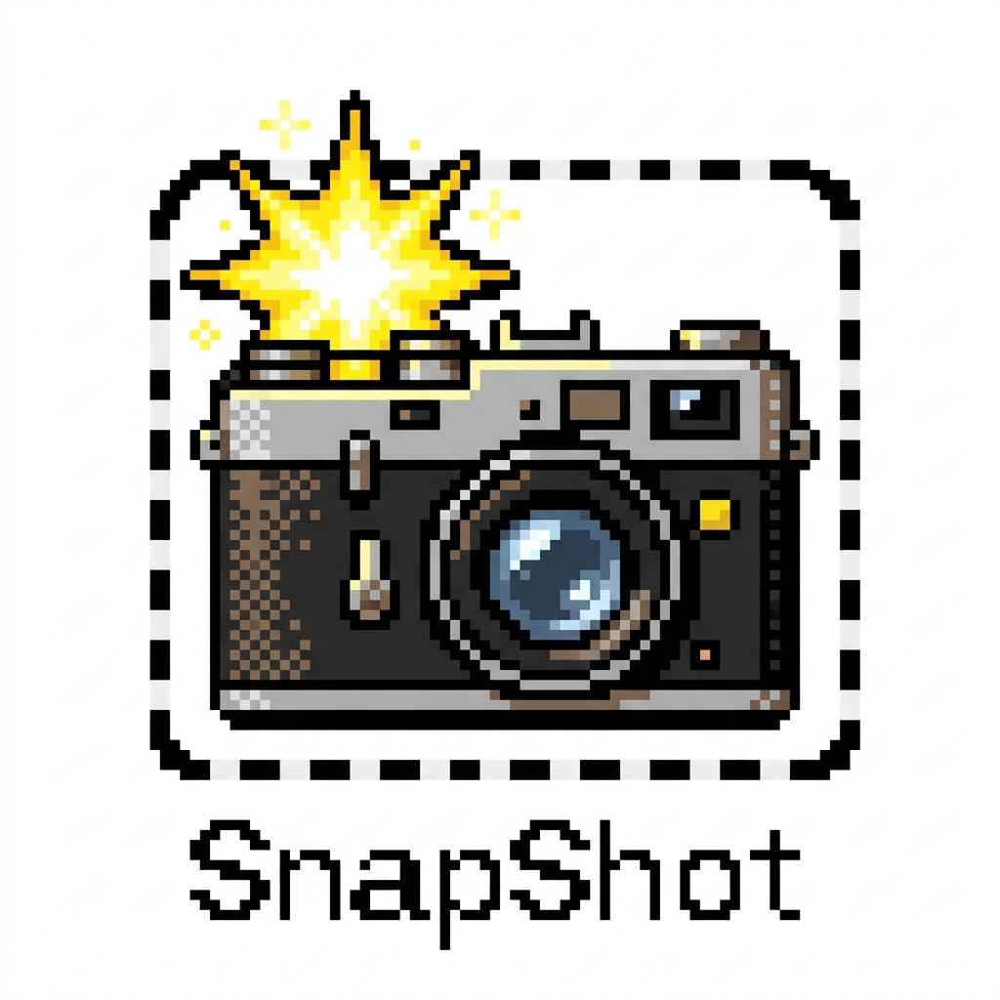
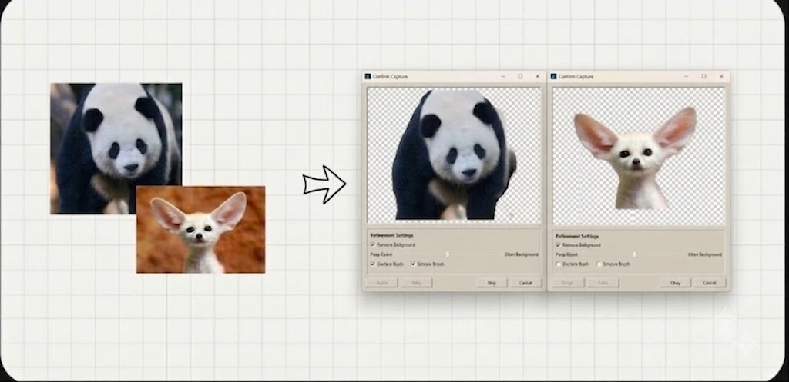

<div align="center">
  

  <h1>SnapShot</h1>

  <p><strong>Local AI-powered screen-to-object capture for Windows.</strong></p>

  <p>
    Select anything on your screen, remove its background entirely on your device,
    refine the cutout, and paste it anywhere as a transparent PNG.
  </p>
</div>

<br>

<div align="center">
  
</div>

---

## ✨ What is SnapShot?

**SnapShot** is a lightweight, local-first Windows utility built with **.NET 10 and WPF** that turns anything on your screen into a clean, transparent, clipboard-ready object.

With a single global hotkey, you can:

1. Capture any region of your screen.
2. Remove its background using **local AI**.
3. Refine the result with real-time brushes and controls.
4. Copy the final transparent PNG directly to your clipboard.

### 🔒 100% Local AI Processing

SnapShot performs background removal entirely on your machine using a lightweight **u2netp ONNX model**.

**No cloud uploads. No external API calls. No server-side processing.**

Your captured images stay on your computer.

---

## 📦 Download

Get the latest pre-compiled executable from GitHub Releases:

[](https://github.com/kuroi17/SnapShot/releases/download/v1.0.0/SnapShot.exe)
[](https://github.com/kuroi17/SnapShot/releases)

> **No installation required.** Run `SnapShot.exe`, and it will quietly run in the background from your Windows system tray.

### Quick Start

1. Run `SnapShot.exe`.
2. Press `Ctrl+Shift+S` from any application.
3. Drag a selection box over the object you want to extract.
4. Fine-tune the cutout using the threshold slider, zoom/pan controls, or paint brushes.
5. Press `Enter` or click **Okay**.
6. Paste (`Ctrl+V`) the transparent PNG into Figma, Discord, Slack, Word, Paint, or any other application that supports images.

---

## ⚡ How It Works

* **Operating System:** Windows 10 / 11 (64-bit)
* **Runtime:** .NET 10.0
* **Architecture:** x64
* **AI Model:** Bundled alongside the executable in the `Assets/` subfolder

### 1. Capture

Press:

```text
Ctrl + Shift + S
```

from anywhere in Windows to activate the screen capture overlay.

Drag over the object you want to extract.

### 2. Remove the Background

SnapShot processes the selected image locally using the bundled **u2netp AI model**.

The result is generated directly on your machine without uploading your image anywhere.

### 3. Refine the Cutout

Fine-tune the result using:

* Threshold adjustment
* Restore brush
* Remove brush
* Zoom and pan controls
* Undo and redo history

### 4. Copy and Paste

Press `Enter` or click **Okay** to copy the transparent PNG directly to your clipboard.

Then paste it anywhere:

**Figma · Discord · Slack · Word · Paint · Anywhere that supports images**

---

## 🚀 Features

### 🧠 Local AI Background Removal

* Lightweight **u2netp ONNX model**
* Runs entirely on-device
* No cloud processing or external API calls
* Approximately **4.7 MB model size**
* Background removal can complete in under **100 ms**, depending on your hardware

### 🎨 Real-Time Cutout Refinement

#### Restore Brush

Paint over removed areas to restore them.

A low-opacity background guide helps you trace the original image accurately.

#### Remove Brush

Erase unwanted foreground areas directly.

The low-opacity guide is hidden while removing areas for a cleaner editing experience.

#### Precision Controls

* Brush size from **1px to 60px**
* 1px increments
* Dedicated `-` and `+` controls
* Dynamic circle cursor
* Cursor scales with brush size and zoom level

### 🔍 Figma-Style Navigation

Navigate large cutouts smoothly with:

* `Ctrl` + Mouse Wheel — Zoom
* `Ctrl` + `+` / `-` — Zoom
* `Shift` + Mouse Wheel — Horizontal pan
* Two-finger touchpad swipe — Pan
* Middle-click drag — Pan
* `Spacebar` + Left-click drag — Pan

### ↩️ Undo & Redo

Full editing history with:

* `Ctrl + Z` — Undo
* `Ctrl + Y` — Redo

Retro-style UI buttons are also available directly in the refinement window.

### 🖼️ Background Preview Modes

Instantly switch between different preview backgrounds:

* 🏁 Light checkerboard
* 🏴 Dark checkerboard
* ⬜ Solid white
* ⬛ Solid black

Useful for checking edge quality and transparency against different backgrounds.

### ⚡ Smooth, Low-Latency Editing

Brush strokes directly manipulate the pixel buffer instead of re-running AI inference.

This keeps painting responsive and avoids unnecessary model re-evaluation during editing.

### 📋 Clipboard-Ready Output

SnapShot writes the final transparent PNG directly to the Windows clipboard.

Capture an object once and paste it immediately into:

**Figma · Slack · Discord · Word · Paint · Other image-compatible applications**

### 🪟 Retro Windows UI

The confirmation and refinement experience is inspired by the classic Windows 95/98 interface.

A little nostalgic. A little weird. Very functional.

---

## 🖥️ System Requirements

* **Operating System:** Windows 10 / 11 (64-bit)
* **Runtime:** .NET 10.0
* **Architecture:** x64
* **AI Model:** Bundled `u2netp` ONNX model

---

## 🛠️ Build from Source

### Prerequisites

Install the **.NET 10 SDK**.

### Clone the Repository

```powershell
git clone https://github.com/kuroi17/SnapShot.git
cd SnapShot
```

### Build

```powershell
dotnet build src/SnapShot.csproj -c Release
```

### Publish as a Single Executable

To package the app into a standalone executable:

```powershell
dotnet publish src/SnapShot.csproj `
  -c Release `
  -r win-x64 `
  --self-contained false `
  -p:PublishSingleFile=true
```

The output executable will be generated at:

```text
src/bin/Release/net10.0-windows/win-x64/publish/SnapShot.exe
```

---

## 🏗️ Architecture

SnapShot is structured around a small set of focused services:

| Component                     | Responsibility                                                                     |
| ----------------------------- | ---------------------------------------------------------------------------------- |
| `App.xaml.cs`                 | Application entry point, global hotkey registration, and system tray orchestration |
| `CaptureOverlay.xaml.cs`      | Fullscreen screen selection overlay                                                |
| `RefinementWindow.xaml.cs`    | Cutout preview, brushes, undo/redo, zoom/pan, and editing controls                 |
| `HotkeyService.cs`            | Global hotkey handling through Win32 `RegisterHotKey`                              |
| `ScreenCaptureService.cs`     | High-performance GDI-based screen capture                                          |
| `BackgroundRemovalService.cs` | Local ONNX inference and image refinement pipeline                                 |
| `ClipboardService.cs`         | Writes transparent PNG data to the Windows clipboard                               |

The background removal and editing pipeline includes:

* ONNX model inference
* Color-guided filtering
* Morphological closing
* Unsharp masking
* Direct pixel-buffer manipulation for real-time brush editing

---

## 📄 License

This project is licensed under the **MIT License**.

See [`LICENSE`](LICENSE) for more information.
