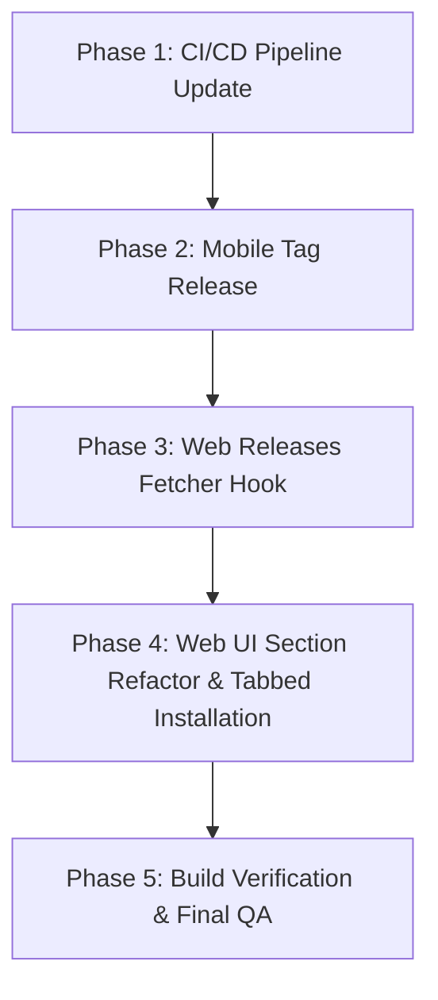

# 🚀 SnapShot Web & Mobile Release Polish — Execution Steps

This document outlines the step-by-step plan to implement prefix-based automated releases, update the website's layout/sections, and integrate mobile downloads.

---

## 🛠️ Global Frontend Skills Integration Strategy

To ensure world-class quality, design taste, and engineering excellence, the agent executing this plan MUST strictly incorporate the following global skills:

| Skill | Primary Usage & Application |
| :--- | :--- |
| **`design-taste-frontend`** | Ensure the tabbed Win95 download component and visual shortcut window look highly-polished, premium, and authentic to retro-classic style. |
| **`minimalist-ui`** | Remove redundant buttons/links, collapse duplicates, and clean up visual clutter across sections. |
| **`ui-ux-pro-max`** | Create smooth tab switching transitions in the installation component and coordinate fluid handle dragging in the comparison slider. |
| **`react-expert`** | Refactor the GitHub release service hook to fetch and filter multiple releases cleanly without memory leaks or race conditions. |
| **`web-design-guidelines`** | Maintain full responsiveness, proper semantic tags, and fast page speeds. |
| **`expo-ui`** | Keep the mobile release info aligned with standard Expo app properties (e.g. bundle size, platforms). |

---

## 📑 Execution Phase Breakdown



---

## 🛠️ Phase 1: CI/CD Pipeline Update (`release.yml`)

Update the GitHub Actions workflow file `.github/workflows/release.yml` to support prefix-based tags:

1. **Trigger Configuration**:
   ```yaml
   on:
     push:
       tags:
         - 'desktop-v*'
         - 'mobile-v*'
     workflow_dispatch:
   ```
2. **Conditional Execution**:
   - If tag starts with `desktop-v*`: Run checkout, setup .NET, publish standalone `SnapShot.exe`, create GitHub Release named `SnapShot Desktop ${{ github.ref_name }}`, and upload the `.exe` asset.
   - If tag starts with `mobile-v*`: Create a GitHub Release named `SnapShot Mobile ${{ github.ref_name }}` (for hosting mobile release details/notes).

---

## 🏷️ Phase 2: Mobile Tag Release Trigger

Trigger the official release of the mobile app to set up the releases history:

1. Stage all pending mobile app codebase changes.
2. Tag the repository with the first mobile tag:
   ```powershell
   git tag mobile-v1.0.0
   git push origin mobile-v1.0.0
   ```

---

## 🔌 Phase 3: Web Releases Fetcher Hook (`useGitHubRelease.js`)

Refactor `website/src/hooks/useGitHubRelease.js` (or ts) to fetch `/releases` instead of `/releases/latest` to cleanly separate desktop and mobile releases:

1. **API URL**: `https://api.github.com/repos/kuroi17/SnapShot/releases`
2. **Filtering Logic**:
   - Parse all releases.
   - Find the first release object where `tag_name` starts with `desktop-v`. Extract its version, date, direct `.exe` download URL, and release notes.
   - Find the first release object where `tag_name` starts with `mobile-v`. Extract its version, date, and release notes.
3. **Graceful Fallbacks**: Provide static defaults if the API rate limit is reached or network is offline.

---

## 🎨 Phase 4: Web UI Section Refactor & Tabbed Installation Component

Revise the landing page sections to eliminate duplicates and organize them in a logical, zero-friction flow:

### 1. Structure Sequence
* **Hero Section**: Headline, pixel camera, unified CTAs (remove duplicate download buttons, keep one key entry point).
* **Before / After Slider**: Update `ComparisonSlider.jsx` to load `RawCapture.png` and `AICutout.png` to clearly show differences.
* **The Workflow (How to Use)**: Step-by-step visual grid mapping the screen capture to paste workflow.
* **Key Features**: Clean grid (Local AI, sub-100ms ONNX speed, privacy).
* **Installation (Double-Tab Win95 Window)**:
  * Implement a tabbed Win95 panel with two tabs:
    * **Desktop**: Displays direct Windows `.exe` download, file size, release date, and platform specifications.
    * **Mobile**: Displays version, release date, platform specifications, and direct link to install/test (EAS/APK).
* **Keyboard Shortcuts Section**: Interactive visual window listing all shortcuts with `<kbd>` retro keycap styling.
* **Contributing & Footer**: Clean bottom section.

---

## 🧪 Phase 5: Build Verification & Final QA

1. Run production build in `website/`:
   ```powershell
   cd website
   npm run build
   ```
2. Verify 0 lint warnings, 0 compile errors, and that assets load correctly.
